# Getting started with dbt

## Project Overview

Role: Data Engineer at Airbnb

General Tasks:

* Load, clean and expose data
* Write tests, automation and documentation

Data source:

* Inside Airbnb Berlin data

Tech Stack

* dbt, Snowflake and Preset (BI)

## Step 1: dbt + Snowflake Setup

After signing up for a trial account, we have to perform the following steps in Snowflake.

1. Setup dbt user

2. Create Airbnb database

See [notes](https://github.com/nordquant/complete-dbt-bootcamp-zero-to-hero/blob/main/_course_resources/course-resources.md)

## Step 2: dbt configuration

Next, we go into our dbt project repo and run through these steps:

1. We run `mkdir ~.dbt`.

2. In our project folder `dbtReview` we run `dbt init dbtlearnV2` and answer setup questions.

3. We `cd dbtlearnV2` and run `dbt debug` to verify if the Snowflake connection was successful.

## Understanding our dbt Folder Structure

From our `dbtReview` folder, if we run `tree` we see

 ```text
.
├── dbtlearnV2
│   ├── README.md
│   ├── analyses
│   ├── dbt_project.yml
│   ├── logs
│   │   └── dbt.log
│   ├── macros
│   ├── models
│   │   └── example
│   │       ├── my_first_dbt_model.sql
│   │       ├── my_second_dbt_model.sql
│   │       └── schema.yml
│   ├── seeds
│   ├── snapshots
│   └── tests
└── logs
    └── dbt.log
 ```

### dbt_project.yml

dbt project level configurations. Here we will see project folder paths defined as well as how `models` get materialized.

`name:` is the name we provided when running `dbt init {project-name}`.

Here, we deleted the settings configurations for `models` and the 2 example `models` created by default.

### dbt Power User

After installing the VSCode extension, we created a `.vscode/` directory to hold our workspace `settings.json` file.

```json
{"files.associations": {
    "*.sql" : "jinja-sql"
}}
```

## Step 3: Building our Data Flow

### Input Data Models

1. Listings
2. Hosts
3. Reviews
4. Full Moon Dates

Note: Full Moon Dates will help us see if a correlation exists between full moons and Airbnb review sentiments. "Do full moons negatively or positively affect Airbnb reviews?"

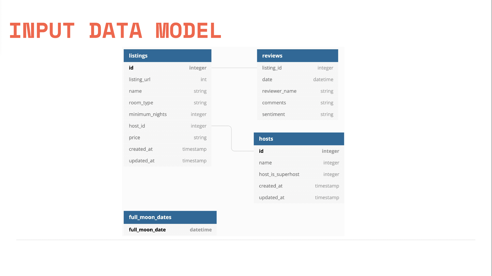

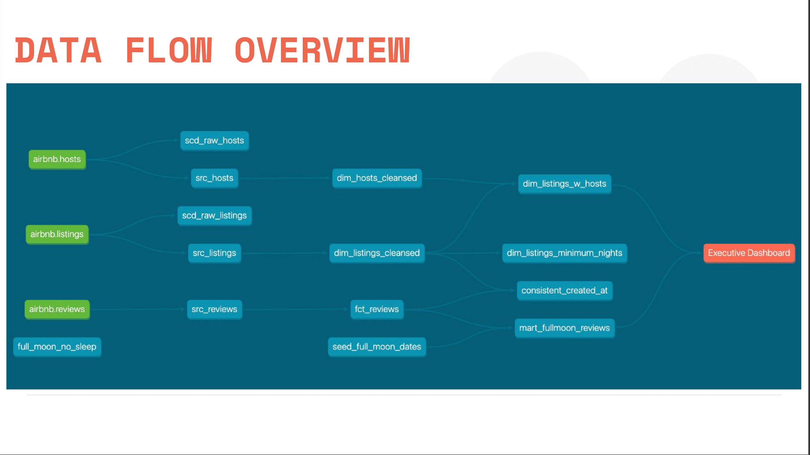

## Source Models

The first Models we will create in our dbt project is our `src_{model-name}.sql` "source" models.

* src_hosts
* src_listings
* src_reviews

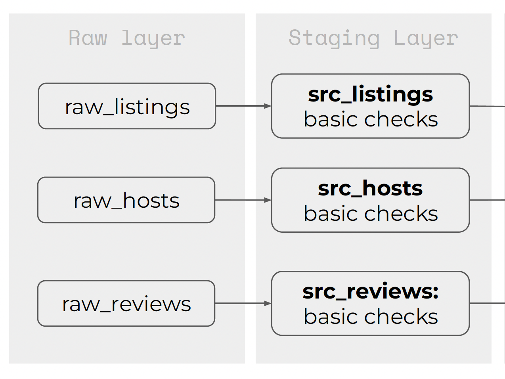

After defining our `src_listings` in Snowflake, we take our query and create a `models/src/src_listings.sql` file for dbt to execute with `dbt run`. Reminder to make sure we are in our `dbtlearnV2` folder.

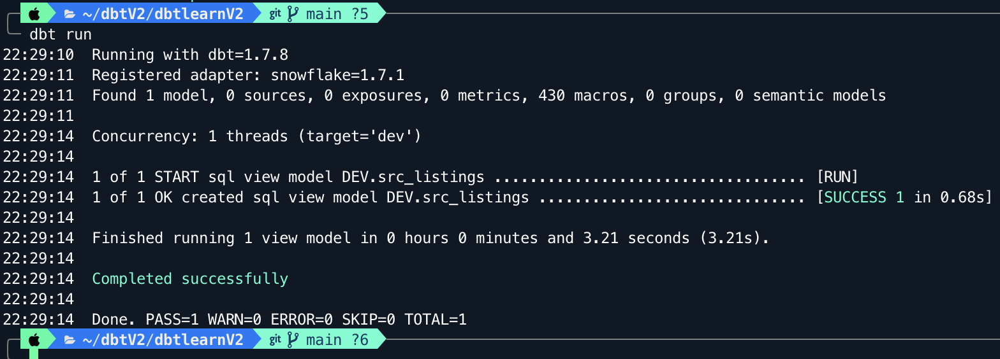

## Materialization Overview

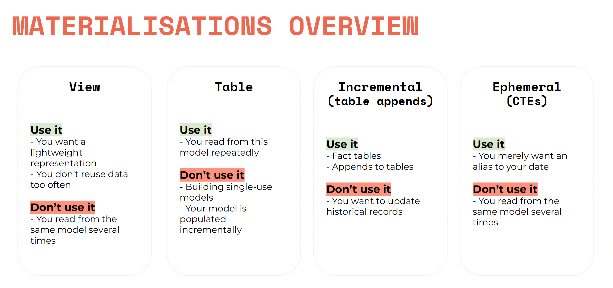

## Core Layer Models

After building our source models, we move on to the "Core Layer."

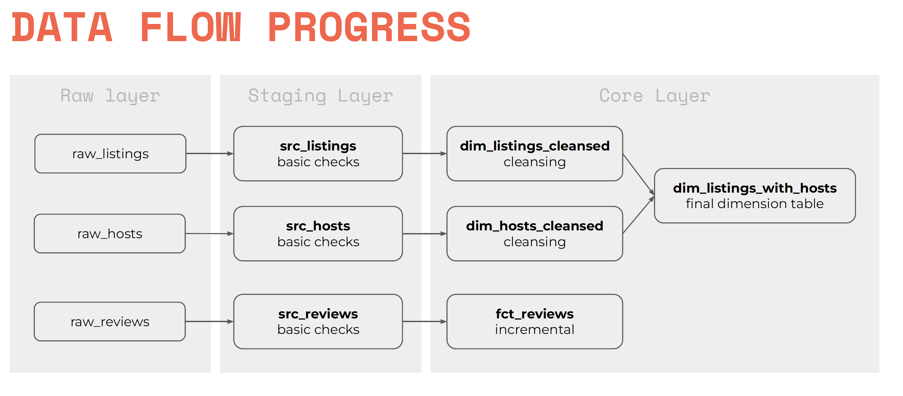

When building the core layer models, it's best practice to be explicit with our model's materialization. To achieve this, we will add a global configuration to our `dbt_project.yml` file.

```yml
# dtb_project.yml
models:
  dbtlearnV2:
    +materialized: view
```

After applying this configuration, we then materialize our `dim` models as tables because they represent "ready to use" data and will be used often for downstream model creation. If we leave our `dim` models are views, we will be executing the underlying sql statement each time we reference the dim model.

```yml
models:
  dbtlearnV2:
    +materialized: view
    dim:
      +materialized: table
```

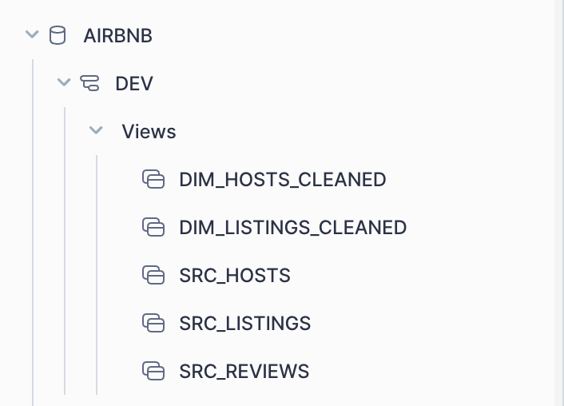

After running `dbt run` we see

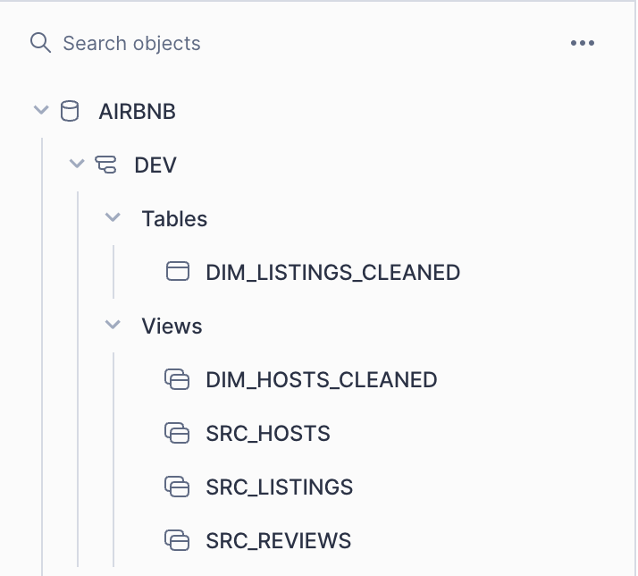

Our `dim_hosts_cleaned.sql` model has an materialization as view config in the .sql file so it does not get materialized as a table. This shows us we can control each model's materialization independent from our global configurations.

### Incremental Materialization

For our `fct_reviews` model, we will be using an incremental materialization.

```sql
{{
    config(
        materialized = 'incremental',
        on_schema_change='fail'
    )
}}
WITH src_reviews AS (
    SELECT * FROM {{ ref('src_reviews') }}
)

SELECT * FROM src_reviews
WHERE review_text is not null


    AND review_date > (select max(review_date) from {{ this }})

```

The incremental part of this model comes from the `.sql` configuration we define at the top of our sql file. Note: `this` refers to our `fct_reviews` model.

With this defined `incremental` materialization, we next define what logic dbt should use to increment. "What defines a new record?"

For `fct_reviews`, we are saying a new record(s) are any from `src_reviews` that have a review date greater than the max review date currently present in our `fct_reviews` table. Now, we have to go one step further and look at `src_reviews` which is a view built from `raw_reviews`. This is why, when we test the incremental loading, we will add a record to `raw_reviews` and not directly to `src_reviews`. If we were to add this new record to `src_reviews` then it would contain a record not present in it's source which is the wrong way to go about this incremental load building.

This is why on the first `dbt run` all records from `src_reviews` are added to the `fct_reviews` model because there is no max date present, the model does not "exist."

To test this incremental loading, we can take a look at listing `3176` from our `fct_reviews` model. We then add a record to our `raw_reviews` model and perform a `dbt run --full-refresh` to "pick up the changes." First, `src_reviews` will get re-built with this new record and then `fct_reviews` will get this record incrementally added.

Row added:

```sql
INSERT INTO "AIRBNB"."RAW"."RAW_REVIEWS"
VALUES (3176, CURRENT_TIMESTAMP(), 'Servin', 'excellent stay!', 'positive');
```

Verification:

```sql
SELECT * FROM AIRBNB.RAW.RAW_REVIEWS
WHERE REVIEWER_NAME = 'Servin';
```

`dbt run --full-refresh`

```terminal
14:15:49  Finished running 4 view models, 1 table model, 1 incremental model in 0 hours 0 minutes and 12.72 seconds (12.72s).
14:15:49
14:15:49  Completed successfully
14:15:49
14:15:49  Done. PASS=6 WARN=0 ERROR=0 SKIP=0 TOTAL=6
```

Snowflake Verification:

After running this Snowflake verification script, we should see our 'Servin' review in our `fct_reviews` model.

```sql
SELECT * FROM "AIRBNB"."DEV"."FCT_REVIEWS" WHERE listing_id=3176;
```

### Ephemeral Materialization

They strategy here is to materialize `dim_listings_with_hosts` and `fct_reviews` as tables because they represent our "final" tables that will be used by downstream users/BI.

`dim_listings_cleaned` and `dim_hosts_cleaned` remain as views and our `src_` models are converted to ephemeral models; this way, they remain as CTEs and are only "built" when upstream `dim_` models materialize.

So, project wise, we change our dbt configs to be:

```yml
models:
  dbtlearnV2:
    +materialized: view
    dim:
      +materialized: view
    src:
      +materialized: ephemeral
```

Our `dim_listings_w_hosts` get's a in-line configuration to overwrite the global config we just set; this is because it's in our `dim` folder which we just set to materialize as `view`.

```sql
-- dim_listings_w_hosts.sql
{{
    config(
        materialized = 'table'
    )
}}

```

Lastly, since these `src_` views already exist in Snowflake, dbt will not drop them so we have to manually drop all `src_` views. Once we do that, we can then run `dbt run` and see how only `4` models are being materialized and not `7` like before. Again, this is because our `src_` models are not ephemeral and remain CTEs.

```terminal
02:33:22  1 of 4 START sql view model DEV.dim_hosts_cleaned .............................. [RUN]
02:33:22  1 of 4 OK created sql view model DEV.dim_hosts_cleaned ......................... [SUCCESS 1 in 0.64s]
02:33:22  2 of 4 START sql view model DEV.dim_listings_cleaned ........................... [RUN]
02:33:23  2 of 4 OK created sql view model DEV.dim_listings_cleaned ...................... [SUCCESS 1 in 0.69s]
02:33:23  3 of 4 START sql incremental model DEV.fct_reviews ............................. [RUN]
02:33:28  3 of 4 OK created sql incremental model DEV.fct_reviews ........................ [SUCCESS 1 in 4.73s]
02:33:28  4 of 4 START sql table model DEV.dim_listings_w_hosts .......................... [RUN]
02:33:29  4 of 4 OK created sql table model DEV.dim_listings_w_hosts ..................... [SUCCESS 1 in 1.30s]
02:33:29
```

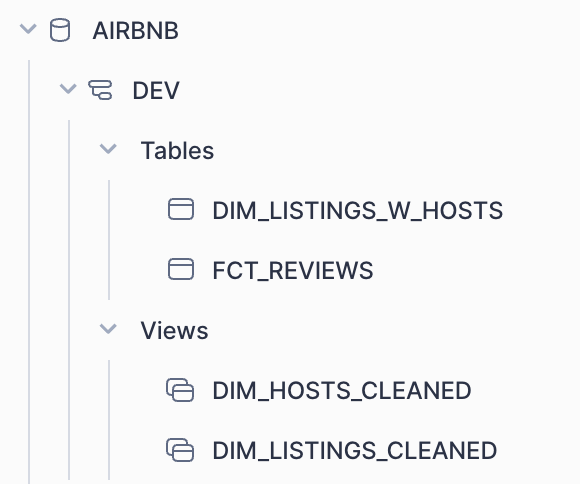

### Locating Ephemeral Models (Target Folder)

So where are these ephemeral models located? Well, in our `dbt_project.yml` file we see a `target-path` configuration defined which states, "directory which store compiles SQL files" If this does not exists, add the following configuration:

```yml
target-path: "target" # directory which store compiles SQL files
clean-targets: # directories to be removed by `dbt clean`
  - "target"
  - "dbt_packages"
```

Here, we are interested in the `run` directory located in our `target` folder.

```terminal
.
{other-folders-here}
├── run
│   └── dbtlearnV2
│       └── models
│           ├── dim
│           │   ├── dim_hosts_cleaned.sql
│           │   ├── dim_listings_cleaned.sql
│           │   └── dim_listings_w_hosts.sql
│           ├── fct
│           │   └── fct_reviews.sql
│           └── src
│               ├── src_hosts.sql
│               ├── src_listings.sql
│               └── src_reviews.sql
├── run_results.json
└── semantic_manifest.json
```

This will show us the final compiles sql for each model we have defined in our project. For example, if we take a look at `dim_listing_cleaned.sql`

`../dbtlearnV2/target/run/dbtlearnV2/models/dim/dim_listings_cleaned.sql`

```sql
-- compiled sql for dim_listings_cleaned model
  create or replace   view AIRBNB.DEV.dim_listings_cleaned

   as (
    WITH  __dbt__cte__src_listings as (
WITH raw_listings AS (
    SELECT
        *
    FROM
        AIRBNB.RAW.RAW_LISTINGS
)
SELECT
    id AS listing_id,
    name AS listing_name,
    listing_url,
    room_type,
    minimum_nights,
    host_id,
    price AS price_str,
    created_at,
    updated_at
FROM
    raw_listings
), src_listings AS (
  SELECT
    *
  FROM
    __dbt__cte__src_listings
)
SELECT
  listing_id,
  listing_name,
  room_type,
  CASE
    WHEN minimum_nights = 0 THEN 1
    ELSE minimum_nights
  END AS minimum_nights,
  host_id,
  REPLACE(
    price_str,
    '$'
  ) :: NUMBER(
    10,
    2
  ) AS price,
  created_at,
  updated_at
FROM
  src_listings
  );
```

And here is where we can see our `ephemeral` CTE `src_` models being referenced by dbt with an internal identifier, `__dbt__cte__src_listings`. Also, this `target` folder is where we will go first to debug any failed dbt run commands since it will show us the full compiled sql being executed to create our models.

## Marts

Our `marts` serve as the "final" tables downstream users will use to interpret the data we present. Therefore, they will most likely be a mix of joins, sub-queries and filters to accommodate our BI tools/downstream users.

For this project, we will create a `mart_full_moon_views.sql`. This table will show us the reviews and if the PREVIOUS night was a full moon, NOT the day of the review .

## Seeds and Sources

Seeds: local files that you upload to the data warehouse from dbt.

Sources: an abstraction layer (a file) on top of your input tables. Sources give us added capabilities such as checking source (data) freshness.

### Configuring Seeds

Seeds, live in our `seeds` folder and are configured globally in our `dtb_project.yml` file.

```yml
seed-paths: ["seeds"]
```

`dbtlearnV2/seeds/seed_full_moon_dates.csv` will be used to check the correlation between full moons and bad reviews. (Theoretical)

After adding our seeds, we run `dbt seed` to populate our data into Snowflake.

```terminal
╰─ dbt seed

15:00:51  Running with dbt=1.7.8
15:00:51  Registered adapter: snowflake=1.7.1
15:00:52  Found 7 models, 1 seed, 0 sources, 0 exposures, 0 metrics, 430 macros, 0 groups, 0 semantic models
15:00:52
15:00:55  Concurrency: 1 threads (target='dev')
15:00:55
15:00:55  1 of 1 START seed file DEV.seed_full_moon_dates ................................ [RUN]
15:01:00  1 of 1 OK loaded seed file DEV.seed_full_moon_dates ............................ [INSERT 272 in 4.91s]
15:01:00
15:01:00  Finished running 1 seed in 0 hours 0 minutes and 8.24 seconds (8.24s).
15:01:00
15:01:00  Completed successfully
15:01:00
15:01:00  Done. PASS=1 WARN=0 ERROR=0 SKIP=0 TOTAL=1
```

### Configuring Sources

In our `../dbtlearnV2/models/sources.yml` file we are first giving aliases to our actual tables from Snowflake. This is part of the abstraction we can achieve by using a `sources.yml` file in our project.

* `name` - the database name from Snowflake.
* `schema` -  the schema from the (^) above database in Snowflake.
* `identifier` - the actual table name from Snowflake.
* `name` - what we would like to call this table in our dbt project. (abstraction)

Now we can reference our `raw` tables are `source` tables. Before we apply these changes our `src_` models were using a direct reference to tables in Snowflake example `AIRBNB.RAW.RAW_LISTINGS` but now, we can reference our `sources` file.

`src_listings` before adding sources:

```sql
WITH raw_listings AS (
    SELECT
        *
    FROM
        AIRBNB.RAW.RAW_LISTINGS
)
SELECT
    id AS listing_id,
    name AS listing_name,
    listing_url,
    room_type,
    minimum_nights,
    host_id,
    price AS price_str,
    created_at,
    updated_at
FROM
    raw_listings

```

`src_listings` after adding sources:

```sql
WITH raw_listings AS (
    SELECT
        *
    FROM
        {{ source('airbnb', 'listings') }}
)
SELECT
    id AS listing_id,
    name AS listing_name,
    listing_url,
    room_type,
    minimum_nights,
    host_id,
    price AS price_str,
    created_at,
    updated_at
FROM
    raw_listings

```

After making these changes to our `src_` models, we can use `dbt compile` to check that these changes compile successfully. Here, there is no need to `dbt run` since we are not introducing new data models - instead what we've done is refactoring which `dbt compile` serves as a check command that let's us know we didn't introduce breaking changes.

## Source Freshness

Source freshness checks give us the ability to check if our ingestion process worked correctly by adding checks to the data and seeing if certain condition are met. Specifically, we look at a timestamp column from our data and see if it's been updated according to our ingestion rules/process.

For this example, we will be looking at the `raw_reviews` table which we added a record previously on `2024-02-19 06:11:56.316` - today is 2/21/2024. So we know our data is "stale" but we can use this for our example. We define all source freshness logic in our `sources.yml` file.

```yml
version: 2

sources:
  - name: airbnb
    schema: raw
    tables:
      - name: listings
        identifier: raw_listings

      - name: hosts
        identifier: raw_hosts

      - name: reviews
        identifier: raw_reviews
        loaded_at_field: date
        freshness:
          warn_after: { count: 48, period: hour }
          error_after: { count: 72, period: hour }
```

* `loaded_at_field: date` is the column from our model to check for source freshness.
* `freshness` are the constrains we define for our data freshness. This of these as tests to check.

We execute these source freshness checks using `dbt source freshness`.

```terminal
dbt source freshness

15:53:13  Running with dbt=1.7.8
15:53:14  Registered adapter: snowflake=1.7.1
15:53:14  Found 1 seed, 8 models, 3 sources, 0 exposures, 0 metrics, 430 macros, 0 groups, 0 semantic models
15:53:14
15:53:15  Concurrency: 1 threads (target='dev')
15:53:15
15:53:15  1 of 1 START freshness of airbnb.reviews ....................................... [RUN]
15:53:16  1 of 1 WARN freshness of airbnb.reviews ........................................ [WARN in 1.22s]
15:53:16  Done.
```

Again, here we used 48 and 72 to account for the new row being added on 2/19 and today is 2/21.

## Snapshots

* How does dbt handle type-2 slowly changing dimension tables?
* What are some strategies we can use when working with Snapshots?

Type 2 Slowly Changing Dimension: This method adds a new row for the new value and maintains the existing row for historical and reporting purposes.

dbt will add 2 columns to our models that are used to track data point (row) changes. `dbt_valid_from` and `dbt_valid_to`.

Strategies

* Timestamp: A `unique_key` and an `update_at` field field is defined on the source model. These columns are used to determine changes.

* Check: Any change in a set of columns (or all columns) will be picked up as an update.

We first verify our `snapshot-paths` is defined in our `dbt_project.yml` folder. For this example, we will be creating snapshots for both `raw_listings` and `raw_hosts`. We choose these tables because they represent the data source, so we want to capture any data changes close to the source. This is not a requirement - just the strategy we will use for this example.

### Raw Listings Snapshot

The `raw_listings` model has a `UPDATED_AT` field that we will use to capture any data changes. If a listing changes, we will know because this `UPDATED_AT` field will change; we tie this to the `ID` and capture the change.

See `../dbtlearnV2/snapshots/snapshot_raw_listings.sql` for snapshot definition.

After defining our snapshot, we use `dbt snapshot` to run our models. In Snowflake, our snapshot wil show up in our `dev` schema under `AIRBNB.DEV.SNAPSHOT_RAW_LISTINGS`.

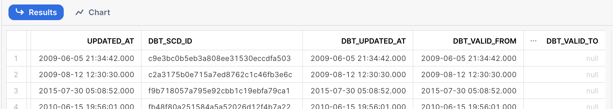

* `DBT_SCD_ID` - internal dbt generated ID
* `DBT_UPDATED_AT` - dbt generated date
* `DBT_VALID_FROM` - column used to track type 2 SCD
* `DBT_VALID_TO` - column used to track type 2 SCD

Now, with our initial snapshot in Snowflake, we will manually change a row from our raw_listings table to see how our snapshot will reflect this change.

```sql
UPDATE AIRBNB.RAW.RAW_LISTINGS SET MINIMUM_NIGHTS=30,
    updated_at=CURRENT_TIMESTAMP() WHERE ID=3176;
```

After running this sql script in Snowflake we need to re-run our snapshots in dbt to capture this change. To "update our snapshot" - dbt will now look at our raw table, compare it with our  initialized snapshot table and find the differences.

We can verify our snapshot captured this change by running:

```sql
SELECT * FROM AIRBNB.DEV.SNAPSHOT_RAW_LISTINGS WHERE ID=3176;
```

| ID   | LISTING_URL                       | NAME                            | ROOM_TYPE       | MINIMUM_NIGHTS | HOST_ID | PRICE  | CREATED_AT              | UPDATED_AT              | DBT_SCD_ID                       | DBT_UPDATED_AT          | DBT_VALID_FROM          | DBT_VALID_TO            |
|------|-----------------------------------|---------------------------------|-----------------|----------------|---------|--------|-------------------------|-------------------------|----------------------------------|-------------------------|-------------------------|-------------------------|
| 3176 | <https://www.airbnb.com/rooms/3176> | Fabulous Flat in great Location | Entire home/apt | 30             | 3718    | $90.00 | 2009-06-05 21:34:42.000 | 2024-02-21 14:27:55.727 | 6b690456297de7444b17cea73ffca47a | 2024-02-21 14:27:55.727 | 2024-02-21 14:27:55.727 |                         |
| 3176 | <https://www.airbnb.com/rooms/3176> | Fabulous Flat in great Location | Entire home/apt | 62             | 3718    | $90.00 | 2009-06-05 21:34:42.000 | 2009-06-05 21:34:42.000 | c9e3bc0b5eb3a808ee31530eccdfa503 | 2009-06-05 21:34:42.000 | 2009-06-05 21:34:42.000 | 2024-02-21 14:27:55.727 |
|      |                                   |                                 |                 |                |         |        |                         |                         |                                  |                         |                         |                         |

## Tests

By default, dbt comes with 2 "standard" test types:

1. Singular Tests -  sql queries that are expected to return an empty result set.
2. Generic Test - global tests applied to models that check null, unique, accepted_values etc.

## Generic Test Implementation

We first begin by looking at our `dim_listings_cleaned` model. By examining our data, we come up with certain conditions to check such as:

* `listings_id` should not be null and unique.
* `host_id` should be not_null and reference `dim_hosts_cleaned.host_id`
* `room_type` is a categorical field so we check distinct entries.

After coming up with conditions to check, we set up our `../dbtlearnV2/models/schema.yml` file which is a very important file in dbt. This `schema.yml` file will contain configurations, tests, and model documentation.

After defining our tests in the `schema.yml` file we execute these tests using `dbt test`.

To view the compiled sql that dbt ran, we can go into `dbtlearnV2/target/compiled/dbtlearnV2/models/schema.yml`. This will show us the full sql script dbt executed which means we can debug and take this into Snowflake if need be. Or we can use the `cat` command to bring up the compiled SQL in our terminal to then copy into Snowflake.

For example, our `accepted_values` test for `dim_listings_cleaned.room_type` compiled to:
```sql
with all_values as (

    select
        room_type as value_field,
        count(*) as n_records

    from AIRBNB.DEV.dim_listings_cleaned
    group by room_type

)

select *
from all_values
where value_field not in (
    'Entire home/apt','Private room','Shared room','Hotel room'
)
```

When we run this in Snowflake, we get no returned records which is what we want. Any records returned means our test failed and these are the records that caused our test to fail.

### Note on Generic Tests

A lot of legacy databases impose these generic constraints at table creation. In MySQL we can add the `UNIQUE` constraint to a column. But, these new cloud based databases sometimes don't have this option which is why these tests are implemented in dbt.

## Singular Tests

Singular tests live in the `test` directory and are SQL queries that we expect to return no records.

The test singular test we will be applying is to our `dim_listings_cleaned` model to check that there are no negative minimum night values. Again, we are first looking at the data and coming up with logic/patterns the data SHOULD follow. So here, we should never expect to see a negative minimum_nights.

The sql for this test is in `../dbtlearnV2/tests/dim_listings_minumum_nights.sql`. Again, tests are executed using `dbt test`.

We can be more specific with our `dbt test` command and point to whichever model we want to test - we do this using `dbt test --select dim_listings_cleaned` which is `dbt test --select {model-name}`.

## Macros, Custom Tests and Packages

### Macros

Macros in Jinja are pieces of code that can be reused multiple times – they are analogous to "functions" in other programming languages. For this example, we will be using Macros to develop our own generic tests.

In other words, macros can serve various purposes. Same as functions, they too can be used to calculate {X} metric, test a condition or create a dynamic data field. Additionally, dbt offers packages, which are purpose-built macros that we can leverage to avoid reinventing the wheel.

Macros live in the `macros` folder. For this example, we will build a "testing" macro that takes in a Model and checks that there are no nulls in ANY/ALL columns. This Macro implemented test is better than using generic test because it allows us to code one macro that checks for nulls and call it on the whole model. No need to go into our `schema.yml` file and individually add these tests one by one.

Source code for the macros is here `../dbtlearnV2/macros/no_nulls_in_column.sql`.

Now, to invoke/call this macro we place it in the `test` folder as a `.sql` file and use Jinja syntax to call the macro on a given model. See `../dbtlearnV2/tests/assert_no_nulls_in_dim_listings_cleaned.sql`

```sql
{{ no_nulls_in_columns(ref('dim_listings_cleaned')) }}
```

Finally, we run this macro created generic test like all test - using `dbt test --select dim_listings_cleaned`.

### Custom Generic Tests

A custom generic test are simply macros with a custom signature. For this example, we will create a generic test that is applied to a `model.column` and asserts that all values in that column are positive. Again here, we are creating this test such that it return any value that is NOT positive.

We do not test - "find all column values that are greater than 1."

```sql
SELECT * FROM MODEL WHERE COLUMN > 1;
```

Source code for the custom generic test is her `../dbtlearnV2/macros/test_positive_value.sql`. On thing to note is that the name of our `.sql` file and the `test` declared do NOT have to be the same. To implement our test, we add it to our `schema.yml` file and execute `dbt test`.

```yml
- name: minimum_nights
  tests:
    - test_positive_value
```

Note: the name of our generic test is `` which follows the format ``.

### Packages

dbt offers many packages, most can be found [here](https://hub.getdbt.com/). General package information can be found [here](https://docs.getdbt.com/docs/build/packages).


For this example we will be installing `dbt_utils` which is a package that offers several utility functions. To add this package to our dbt project we create a `packages.yml` file and paste the package import instruction.

To install a package we run `dbt deps`.

```terminal
dbt deps

18:38:10  Running with dbt=1.7.8
18:38:10  Updating lock file in file path: /Users/joseservin/dbtV2/dbtlearnV2/package-lock.yml
18:38:10  Installing dbt-labs/dbt_utils
18:38:10  Installed from version 1.1.1
18:38:10  Up to date!
```

For this example, we will be using the `dbt_utils.generate_surrogate_key` function to create a hash key in our `fct_reviews` model that is comprised of several columns listed. For example, if you have a model that does not contain a unique column; such as fct_reviews, we can use `dbt_utils.generate_surrogate_key` to create a unique hash from a list of columns we specify.

To use this package, we go into our `fct_reviews` model and call the dbt_utils function.

```sql
{{
    config(
        materialized = 'incremental',
        on_schema_change='fail'
    )
}}
WITH src_reviews AS (
    SELECT * FROM {{ ref('src_reviews') }}
)

SELECT
{{ dbt_utils.generate_surrogate_key(['listing_id', 'review_date', 'reviewer_name', 'review_text']) }}
    AS review_id,
    *
FROM src_reviews
WHERE review_text is not null


    AND review_date > (select max(review_date) from {{ this }})

```

After applying our `dbt_utils` function to our model, we cannot simply `dbt run` because we've specified that `on_schema_change=fail`. We therefore, have to perform a `full-refresh` to rebuild our incremental `fct_reviews` with the surrogate key taken into consideration. Therefore, we run `dbt run --full-refresh` or to be more specific, we can execute `dbt run --full-refresh --select fct_reviews`.

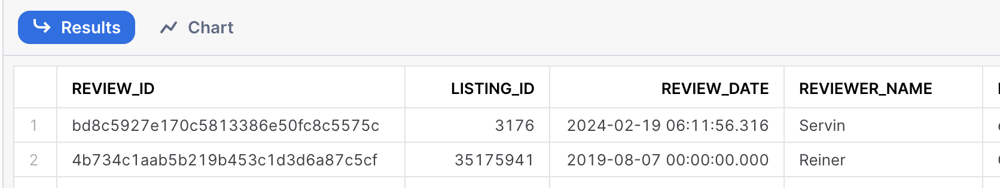

## Documentation

Simple documentation can be added directly into files like our `schema`, `sources` and `test` files. For example, if we want to document our models we'd go into our `schema.yml` file and add documentation like so:

```yml
version: 2

models:
  - name: dim_listings_cleaned
    description: Cleaned table which contains Airbnb listings.
    columns:
      - name: listing_id
        description: Primary key for the listing
        tests:
          - unique
          - not_null

      - name: host_id
        description: The hosts's id. References the host table.
        tests:
          - not_null
          - relationships:
              to: ref('dim_hosts_cleaned')
              field: host_id

      - name: room_type
        description: Type of the apartment / room
        tests:
          - accepted_values:
              values:
                ["Entire home/apt", "Private room", "Shared room", "Hotel room"]
```

Sometimes, our documentation might require more explanation/space - to add lengthy or more organized documentation we

To compile our documentation we use `dbt docs generate` - which writes a JSON catalog in our `target` folder. To spin up the dbt server, we use `dbt docs serve`. This command will start a lightweight webserver on port 8080.

Preview of dbt docs:

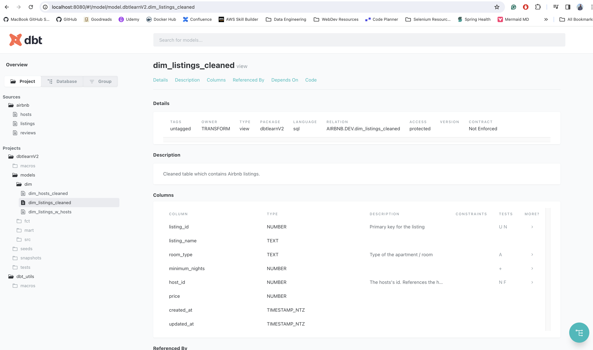

### dbt Dock Blocks

We can add more sophisticated documentation with markdown. We do this by creating a`dim_listings_cleaned.md` file in our `models/dim` folder and reference the documentation name in the `documentation:` tag of our `schema.yml`. The documentation is created in between jinja tags which we use to reference what documentation we are specifically calling. In our `schema.yml` file we use the `'{{ doc("dim_listing_cleaned_minimum_nights") }}'` to serve the documentation.

```yml
- name: minimum_nights
  description: '{{ doc("dim_listing_cleaned_minimum_nights") }}'
  tests:
    - test_positive_value
```

Now, since we've applied new documentation to our dbt project we need to `dbt docs generate` and `dbt docs serve` in order to see the changes.

More information on dbt Docs Blocks can be found [here](https://docs.getdbt.com/docs/collaborate/documentation#using-docs-blocks).

### dbt Overview Page

The overview page is the main page we see when we open the webserver for `dbt docs serve`. We can customize this page by using the `__overview__` tag in our `docs` declaration.

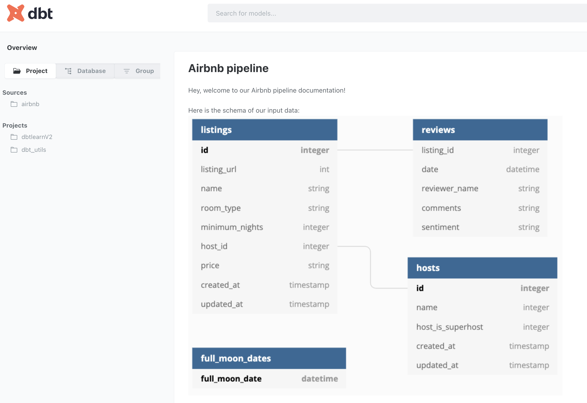

### Managing Document Assets

As out dbt project grows, we should focus on organizing our code and project so that everything is nicely bundled together. For images/assets, we can achieve this by creating a `./dbtlearnV2/assets` folder. The simple creation of this folder is not enough, we must now configure our dbt project so that it knows this folder exists.

```yml
# dbt_project.yml
asset-paths: ["assets"]
```

In this `asset` folder, we place the `png` file that was being used in our `overview.md` file - this now becomes a static path rather than an S3 bucket that was publicly available.

Before assets:

```yml

```

After adding image in assets folder:

```yml

```

Now, as our dbt project grows we can use this asset folder to hold "static" content like image and view them in our docs with the standard commands, `dbt docs generate` and `dbt docs serve`. Behind the scenes, dbt compiles our docs and again, places that in the `target` folder so we can `ls target` and see the newly created `assets` folder (compiled version).

## dbt Lineage Graph (Data Flow DAG)

DAG's provide a visual mapping of our data and model relationships. Here, we see the parents/children and how our data transforms from raw, to source to dim and finally fact.

The DAGs provided by dbt will be critical in understanding our dbt project but they are not build automaically. The model relationships are defined by us, the developer. By using `ref{{}}` tags properly throughout our project, we are defining these model relationships.

*"Remember SoFi and their hard-coded model paths."*

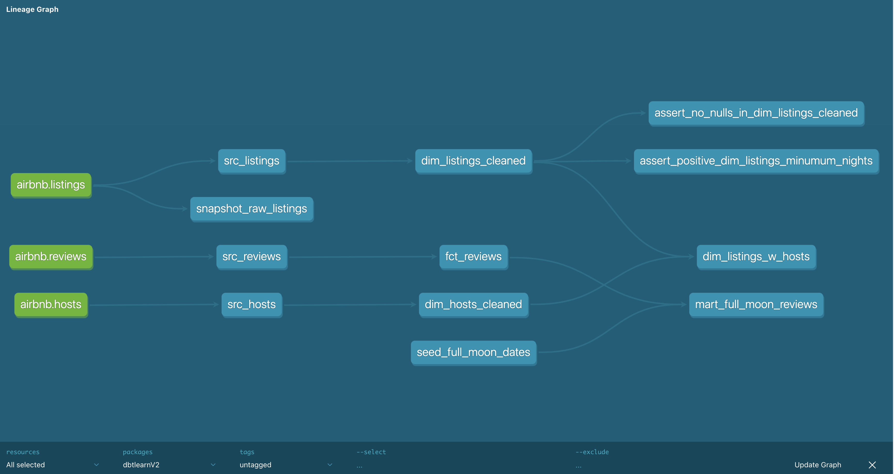

A new integration that was added to dbt Power User is the Lineage and Documentation tabs which allows us to view our DAGs without having to generate dbt docs.

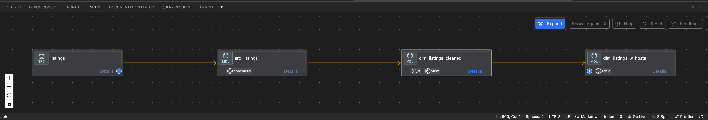

## Analyses, Hooks and Exposures

### Analyses

Sometimes, we will have `SQL` statements that are needed for the project but don't necessarily represent a model. For example, we might have a couple "Ad-hoc" queries that are common enough we want to track. "These more "analytical" SQL files can be versioned inside of your dbt project using the analysis functionality of dbt." [Read more here](https://docs.getdbt.com/docs/build/analyses)

We store these analytical SQL statements in the `../dbtlearnV2/analyses` folder.
The key here is that these `sql` queries will not materialize in our database but we can still version control them and leverage jinja template syntax in the sql definition.

To execute these analyses sql scripts, we first compile with `dbt compile` and then locate the compiles sql statement in our `target` folder.

Compiled location: `cd target/compiled/dbtlearnV2/analyses/full_moon_no_sleep_correlation.sql` so we can take this query and run it in Snowflake.

full_moon_no_sleep SQL compiled:

```sql
WITH fullmoon_reviews AS (
    SELECT * FROM  AIRBNB.DEV.mart_full_moon_reviews
)
SELECT
    is_full_moon,
    review_sentiment,
    COUNT(*) as reviews
FROM
    fullmoon_reviews
GROUP BY
    is_full_moon,
    review_sentiment
ORDER BY
    is_full_moon,
    review_sentiment;
```

### Hooks

Hooks are snippets of SQL that are executed at different times.

Hook Types

* `on_run_start`: executed at the start of dbt {run, seed, snapshot}
* `on_run_end`: executed at the end of dbt {run, seed, snapshot}
* `pre-hook`: executed before a {mode, seed, snapshot} is built
* `post-hook`: executed after a {mode, seed, snapshot} is built
